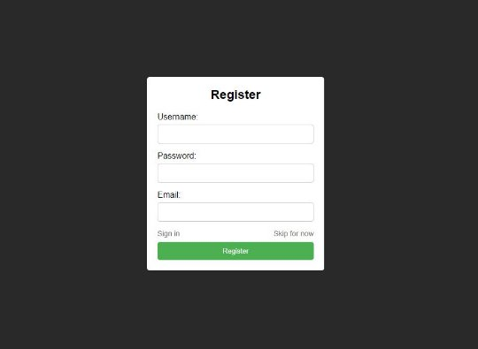
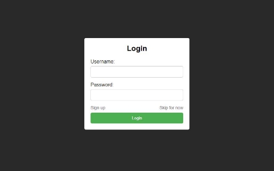
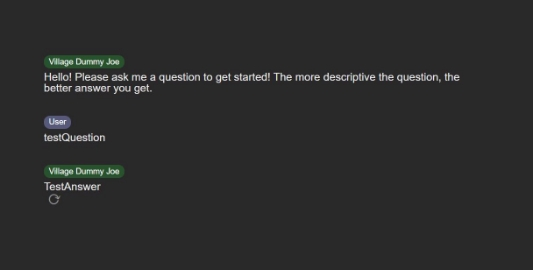
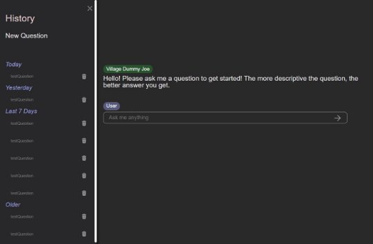


# **Sprawozdanie**  

## Opis
Nasz projekt to strona internetowa która zapewnia użytkownikom możliwość zadawania pytań na różnorodne tematy oraz otrzymywania szybkich odpowiedzi.

### *W naszym projekcie są dostępne takie funkcjonalności*:

## **Logowanie** 

Jest możliwość rejestracji dla dostępu do części funkcjonalności nie dostępnych niezalogowanym użytkownikom, takich jak historia pytań oraz je zarządzanie. 

Niezalogowanym użytkownikom dostępne są: możliwość zadawać pytania, otrzymywać i aktualizować odpowiedzi, oraz fakty randomowe. 

### *Strona techniczna*

Dla zapisu danych logowania użytkowników wykorzystujemy bazę danych MongoDb[ https://www.mongodb.com/](https://www.mongodb.com/)

Dla zwiększenia bezpieczeństwa użytkowników użyliśmy też Cookie JWT token do autoryzacji, weryfikacji haseł oraz zapamiętywania informacji użytkowników. 

## **Pytanie-Odpowiedź** 

Po wpisaniu pytania do linii zapytaniowej użytkownik otrzymuje szybką odpowiedź na pytanie.

Jest możliwość aktualizować odpowiedź używając strzałki pod odpowiedzią. 

### *Strona techniczna*

Do generowania odpowiedzi użyliśmy Exa API  https://exa.ai/  

Exa to inteligentny system, który analizuje pytania użytkowników i wyszukuje odpowiedzi w dokumentach dostępnych publicznie w Internecie. Następnie prezentuje te odpowiedzi jako potencjalne rozwiązania na naszej platformie. 

## **Fakty randomowe** 

Z każdą nadaną odpowiedzią pojawia się randomowy fakt. 

### *Strona techniczna*

Dla generowania faktów randomowych wykorzystaliśmy Facts API udostępnionych przez API Ninjias.  

https://api-ninjas.com/api/facts  

## **Historia** 

Dla zalogowanych użytkowników jest dostępna historia pytań z opisem dawności zadanego pytania i możliwością go usunięcia z historii. 

### *Strona techniczna*

Przy usunięciu z historii, pytanie i przywiązany do niego fakt randomowy zostają usunięte z bazy danych użytkownika. 

## **Podsumowanie**  

### **Nasz projekt to strona internetowa oferująca  pięć funkcjonalności:**  

- *Logowanie*
- *Pytanie-Odpowiedź*
- *Fakty randomowe*
- *Historia pytań*  
- *Zarządzanie historią* 

### **Projekt zostaw *zintegrowany z dwoma zewnętrznymi API*:**

*Exa API* generujące odpowiedzi  
*Facts API* generujące fakty losowe.  

### **Użyte technologii to:**

Client side: JavaScript, HTML i СSS 

Server side: NodeJS, REST API, JSON 

MongoDB - baza danych dla przechowania danych zalogowanych użytkowników 

Cookie JWT token dla autoryzacji użytkowników 
